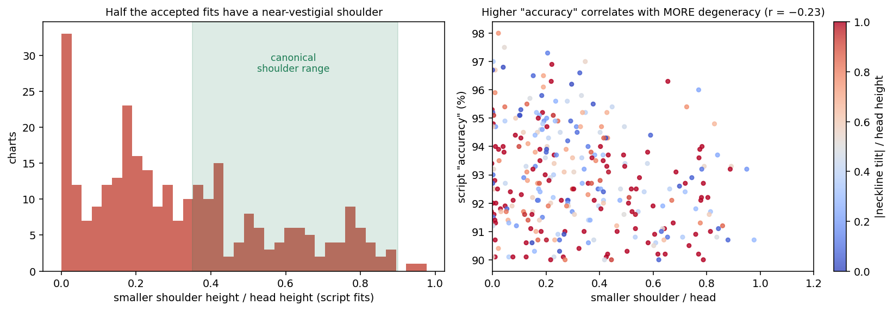
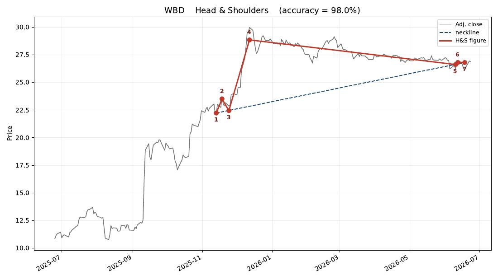
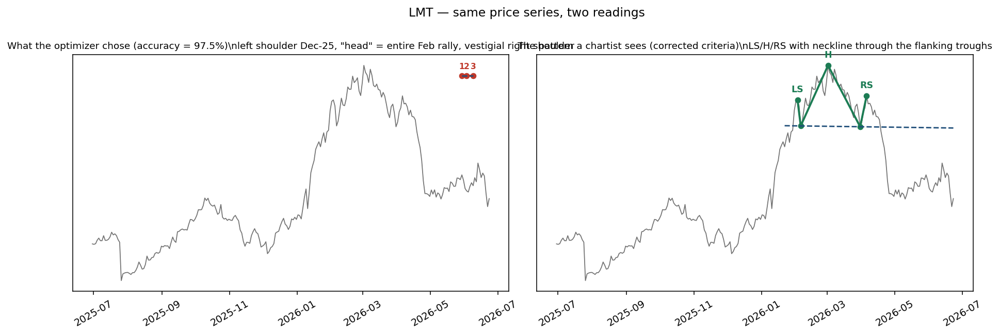
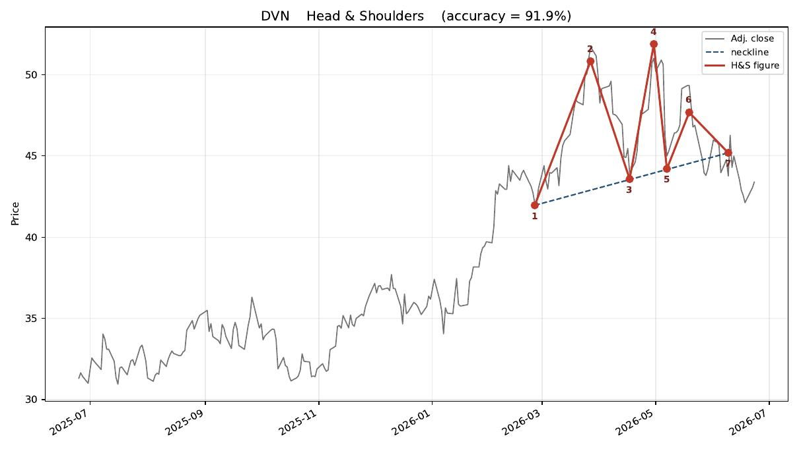
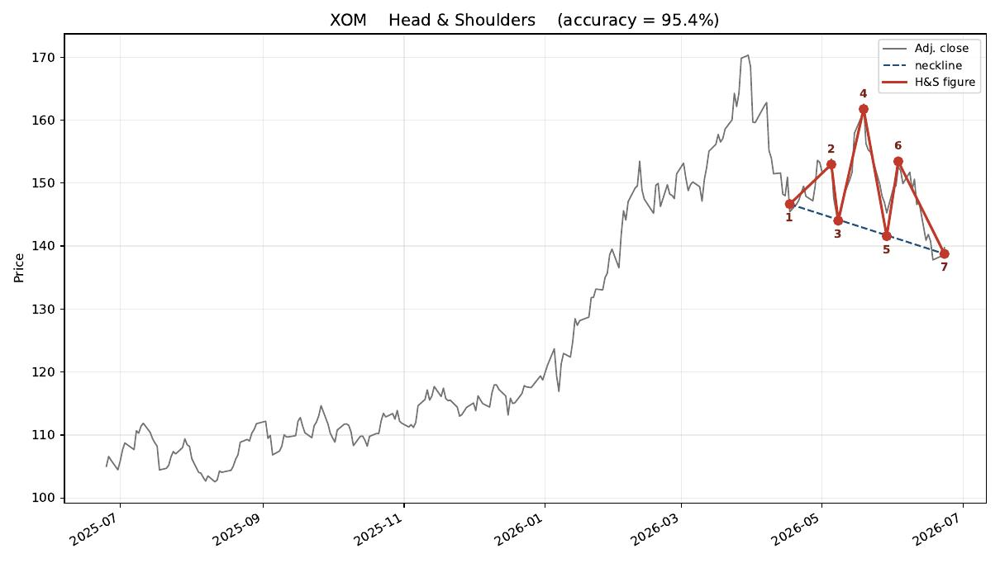
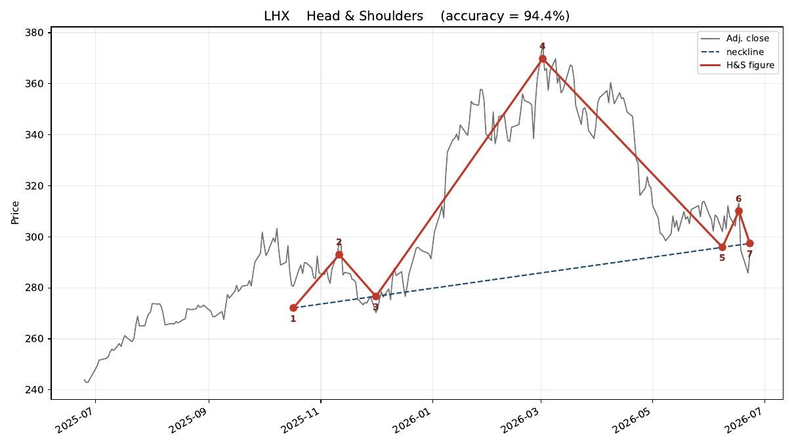

# Canonical Technical Analysis Figures

Technical Analysis is medieval lore. For years, were curious how much signal there was in those shapes.

My analysis is split into two parts: (1) a "textbook" implementation of a head-and-shoulders pattern identification; (2) "advanced" steps that (could) take the basic textbook implementation to a modern production level.

## Part One. Basic Head-and-Shoulders Screening Script.

This "textbook" version is implemented by the associated Jupyter notebook. 

Screen S\&P 500 constituent stocks for the \*\*head-and-shoulders\*\* technical chart pattern as of a given date and write a PDF containing one annotated price chart per stock that exhibits the pattern.

Design overview
\---------------
A generic ``Pattern`` base class holds the parameters describing a fitted pattern.  ``PatternHeadAndShoulders`` is a concrete subclass parameterized exactly as specified:
&#x20;   parameters = d1..d7, c, b, h, y2, y6
&#x20;   dot 1 = (d1, c + b\*(d1 - d7))      # left  neckline point   (on line)
&#x20;   dot 2 = (d2, y2)                   # left  shoulder peak     (above line)
&#x20;   dot 3 = (d3, c + b\*(d3 - d7))      # neckline point         (on line)
&#x20;   dot 4 = (d4, y2 + h)               # head peak (the highest) (above line)
&#x20;   dot 5 = (d5, c + b\*(d5 - d7))      # neckline point         (on line)
&#x20;   dot 6 = (d6, y6)                   # right shoulder peak     (above line)
&#x20;   dot 7 = (d7, c)                    # right neckline point    (on line)

Dots 1,3,5,7 are collinear (the \*neckline\* price = c + b\*(date - d7)); dots 2,4,6 sit above the neckline, with dot 4 the highest of the three.

``fit()`` chooses all twelve parameters from a price series so as to minimize the vertical distance between the series and the seven connecting line segments, subject to the structural constraints above plus the recency rule that ``(run\_date - d7) < (d7 - d5)``. ``accuracy()`` returns a distance-based quality score in \[0, 1]:
&#x20;   accuracy = 1 - SS\_res / SS\_base
where SS\_res is the squared vertical distance from the price series to the seven-segment figure (the quantity ``fit()`` minimizes) and SS\_base is the squared vertical distance from the series to the figure's own neckline.  A value of 1 means the figure passes through the data exactly (zero distance); a value near 0 means the figure fits no better than a plain straight line, i.e. there is no genuine head/shoulders structure.  Normalizing by the neckline (rather than by the mean, as a plain R^2 would) is what stops a flat "figure" riding a trend from scoring highly.  Stocks scoring above the cutoff (default 0.90) are deemed to exhibit the pattern on the run date.

Head-and-shoulders shapes occur readily in random price paths, so a positive screen is a starting point for inspection, not a trading signal. The screen can be tightened by raising ``--cutoff`` or by adding optional 
criteria (e.g. shoulder-height symmetry, near-horizontal neckline) inside ``PatternHeadAndShoulders.fit``.

## Part Two. Taking Our Head-and-Shoulders Screening Script to The Next Level.

The "textbook" screen of PArt One flagged **294 of ~500 S&P constituents (59%)**. A head-and-shoulders top is supposed to be a relatively uncommon reversal formation; it cannot be simultaneously present in three of every five large caps. That headline number alone says the mathematical definition is far too permissive — and after extracting the exact vector geometry of every chart in the PDF and reviewing the charts themselves, the diagnosis is precise: the seven-dot definition admits almost any shape, and the "accuracy" score used to rank candidates actively *prefers* degenerate shapes over textbook ones.

Punchline:

**Definition** can be tightened with a handful of *linear* constraints (so the elegant convex inner fit is fully preserved) plus a confirmation layer, and the accuracy metric should be replaced. Re-screening the same 294 price series with the corrected criteria collapses the list to **5 confirmed fresh signals and 11 unbroken setups**; the other 278 charts are degenerate, stale, played out, failed, or invalidated.

**Of the 294 charts, only about 11 (≈4%) constitute a true bearish signal as of the run date**, and only ~5 of those are fresh: **XOM, DVN, BMY, KR, NDAQ** (the last two with caveats). Another half-dozen (LHX, REGN, EQT, HCA, HII, NOC…) are genuine patterns whose breakdown had already happened weeks earlier and largely delivered its measured move. The section "What I do differently from the formula" spells out the exact methodological gap — most of which, importantly, *can* be captured mathematically.

---

### Can the mathematical definition be adjusted precisely? Yes.

#### 1.1 What the current definition actually accepts

The script's pattern is seven dots: dots 1-3-5-7 collinear on a neckline `p = c + b·x`, dots 2-4-6 (shoulder, head, shoulder) above it, head above the shoulders. The dot prices are affine in the parameters θ = (c, b, h, y₂, y₆), so for each candidate placement of the neckline dots the inner fit is a small convex QP — a genuinely nice construction worth keeping.

The problem is what the constraints *don't* say. Every inequality uses a tolerance `eps = 1e-4 × price range` — effectively zero. So the accepted set includes shapes where:

* the head exceeds a shoulder by a hair, or a "shoulder" is a barely-visible ripple (no minimum shoulder-to-head ratio);
* the two shoulders bear no relation to each other (no symmetry constraint);
* the neckline slopes as steeply as the prevailing trend (no tilt bound), so any pullback chain inside a strong rally qualifies;
* the head spans nearly the entire pattern while the shoulders are corner artifacts (no width constraints);
* the window endpoints serve as neckline anchors, letting the "pattern" lean on the edge of the data.

There is also no requirement that anything *precedes* or *follows* the pattern: no prior advance to reverse, and no neckline break — dot 7 sits *on* the neckline by construction, so a hit is at best an unbroken setup, never a triggered signal.

#### 1.2 The deeper flaw: the accuracy metric rewards degeneracy

`accuracy = 1 − SS_res/SS_base` measures how much of the price's variance around the fitted neckline the red polygon explains. A single giant triangle spanning most of the window explains almost all of it. The optimizer therefore earns its highest scores by inflating the head and shrinking the shoulders — the opposite of pattern quality.

This is measurable. From the extracted geometry of all 294 accepted fits:

| Property of the script's own fitted figures | Share of 294 |
|---|---|
| Smaller shoulder < 25% of head height | **48%** |
| Smaller shoulder < 10% of head height (vestigial) | 19% |
| Head occupies more than ⅔ of the pattern's width | 21% |
| Neckline tilt exceeds 0.35 × head height across the pattern | **72%** |
| Prior advance into the pattern < 0.5 × head height | 54% |
| Price still **above** the neckline at run date (unconfirmed) | **73%** |
| Fits meeting canonical shoulder/symmetry/tilt proportions | **8% (24 of 294)** |

Median shoulder symmetry is 0.42; the median smaller shoulder is 27% of the head. And critically, the correlation between the script's accuracy score and the smaller-shoulder ratio is **−0.23** (and −0.17 vs neckline tilt): *higher reported accuracy is associated with more degenerate geometry.* The metric isn't merely failing to filter bad shapes — it is ranking them on top.



The poster child is the #1 hit, WBD at 98.0% "accuracy": a steep neckline riding an uptrend, a left shoulder 20% of the head, and a right shoulder **2%** of the head — a fit no chartist would recognize as a pattern at all:



The subtler and more damaging consequence: **even when a textbook pattern exists in the data, the optimizer reports a different, degenerate one**, because the degenerate placement explains more variance. LMT is the clean demonstration — the price series contains a genuine top (which subsequently broke down and delivered), but the 97.5%-accuracy fit is a giant triangle with a vestigial right shoulder:



#### 1.3 The precise adjustments

Define, inside the existing QP, the three heights above the neckline — all **linear in θ**, so convexity is untouched:

```
S_L = y₂ − (c + b·d₂)      left-shoulder height
H   = y₂ + h − (c + b·d₄)  head height
S_R = y₆ − (c + b·d₆)      right-shoulder height
```

Then replace the near-zero eps constraints with proportion constraints (each a pair of linear inequalities):

1. **Shoulder scale:** `0.35·H ≤ S_L ≤ 0.90·H` and likewise for `S_R`. This alone eliminates roughly half of the current book.
2. **Shoulder symmetry:** `S_L ≥ 0.55·S_R` and `S_R ≥ 0.55·S_L`.
3. **Neckline tilt:** `|b|·(d₇ − d₁) ≤ 0.30·H`. Consider making it asymmetric — about `0.15·H` for upward-sloping necklines but `0.45·H` for downward-sloping ones, since a falling neckline is classically acceptable (even more bearish) while a rising one is usually just trend (MCD, page 8, is a borderline case that only a downward-tilt allowance would admit).
4. **Widths** (outer loop, on the dot indices before solving): `0.45 ≤ (d₄−d₂)/(d₆−d₄) ≤ 2.2`, head width ≤ ~0.6 of the pattern span, and exclude the window endpoints as neckline anchors.
5. **Neckline definition:** anchor it on the two troughs flanking the head (d₃, d₅) and require d₁, d₇ only to lie within a tolerance band of that line, rather than exact four-point collinearity. Four exact touches is stricter than the classical definition in the one place where strictness doesn't help.
6. **Prior trend:** require the advance into the pattern (e.g., from the low of the preceding `d₇−d₁` bars up to d₂'s level) to be at least `0.5·H`. A reversal needs something to reverse; 54% of current hits fail this.
7. **Amplitude:** `H ≥ 3–4 × ATR(14)` (or ≥ ~8% of price), so the pattern stands out from noise. Fit on log prices so percentage geometry is scale-free.
8. **Confirmation layer** (post-fit, cheap): a *signal* exists only if price has closed below the extended neckline by `max(0.1·H, 2·ATR)` within the last ~25 bars; it is **stale** if the break is older; **played out** once price has traveled ≥ 1·H below the neckline (measured move complete); **failed** if price re-closes above the neckline after breaking; **invalidated** if any post-pattern high exceeds the right shoulder. The current screen has no such layer — which is why 73% of its hits never broke at all and most of the rest broke months before the run date.
9. **Score:** replace global variance-explained with a *worst-segment* score — split the pattern into its six legs and take the minimum per-leg fit quality — or correlate the normalized shape (time and height rescaled to unit coordinates) against a canonical H&S template. Either way, one dominant leg can no longer carry the score, which is exactly the failure mode of R² here. Finally, with ~495 dot-placement combinations tried per stock across 500 stocks, some multiplicity control (penalize per candidate tried, or simply rely on the hard constraints plus confirmation rather than a scalar threshold) keeps random-walk artifacts out.

**Empirical effect.** I re-implemented the corrected criteria and ran them over the same 294 price series (extracted from the PDF's vector data). Result: 189 have no valid pattern at all, 53 are invalidated (price later exceeded the right shoulder), 6 failed, 8 are stale breaks, 12 played out, 10 still forming, **11 unbroken setups, and 5 confirmed fresh signals**. That is the difference between a screen and a coin-flip generator.

---

### Which charts are TRUE bearish signals, and what a modern implementation would do differently

I used Claude to extract every chart's price polyline and fitted figure from the PDF's vector layer (giving exact geometry, not pixel guesses), review all charts, and inspect every shortlisted chart at full resolution. Verdicts below are Claude judgments, cross-checked against the extracted geometry. 

Importantly, the index-wide narrative dominates this dataset: broad top between Nov-2025 and Feb-2026, a hard selloff into April 2026, then a strong May–June rebound. Consequences: nearly every stock's 250-day window contains a big arch (a free "head"); most genuine necklines broke in **March–April** and either delivered their measured move or were reversed by the June rebound. A screen run on 2026-06-23 with no concept of confirmation age therefore surfaces a mass of stale, spent, and outright failed patterns — which is exactly why "most of the flagged stocks did not behave bearishly."

**True, actionable bearish signals at the run date** — completed pattern, recent neckline break, move not yet exhausted:

| Ticker | Page | Assessment |
|---|---|---|
| **XOM** | 26 | Textbook top after a strong advance (LS ~112 / head ~123 / RS ~117); broke its neckline ~2 weeks before the run; only ~0.15 of the measured move spent. The cleanest fresh signal in the book. |
| **DVN** | 196 | Near-perfect proportions (shoulder symmetry 0.98), mild neckline tilt, clear prior advance; break ~9 days old. |
| **BMY** | 77 | Valid top after a long advance; neckline tilt near the acceptable limit; break ~3 weeks old. Second tier but genuine. |
| **KR** | 257 | Valid pattern, but the break was an abrupt gap-style collapse ~3–4 weeks prior; ~0.8 of the measured move already spent. True, partially consumed. |
| **NDAQ** | 115 | Marginal: shoulder symmetry at the floor (0.55); reads as a spike top plus support break more than a classic H&S. Bearish, but borderline as this pattern. |





**Genuine patterns, already triggered and largely delivered by 6/23** — true head-and-shoulders that a chartist would validate historically, but late as entries: **LHX** (textbook, break ~5 weeks old, measured move exceeded), **REGN**, **EQT**, **HCA**, **HII**, **NOC**, **LMT**, **MTD**, **ROL**, **IDXX**, **WM** and **PPL** (both retesting their necklines from below), **AWK**, **SRE**, **RSG**, **CTVA**; and ancient, fully-resolved cases **CEG, WYNN, PSKY, HOOD, DHI**. These are the charts that vindicate the *pattern* while indicting the *screen's timing*: flagging LHX two months after the break, a full measured-move lower, is not a signal.



**Valid shape, no break — watchlist, not signals:** GRMN, COST, TXT (one of the most textbook shapes in the whole set, sitting ~2 points above its neckline), AMGN, FAST, FE, PCAR, HIG, TDY, WMT, plus NEM and OKE with weak context (NEM's pattern sits inside a powerful gold-driven uptrend; OKE's inside a larger downtrend's rebound). A head-and-shoulders is not bearish until the neckline goes; these are conditional orders, not positions.

**Rejected on visual review even though the geometry passes:** TEL, ALGN, OXY, PEP, DECK, PHM — in each case context kills the pattern (violent April crashes followed by V-recoveries that dominate the tape, mid-range chop with no advance to reverse, or price sitting most of a head-height above the trigger). **Failed by run date:** ED, AXP, DLTR, RJF, DUK, SO — broke, then re-took the neckline on the June rebound; a failed H&S is classically a *bullish* event. **Everything else — 242 of 294 charts — has no valid pattern or was invalidated** by price exceeding the right shoulder before the run date.

Net: **~5 fresh + ~6 defensible late-stage ≈ 11 true bearish signals out of 294 flags**, with ~10 more legitimate formations pending confirmation.

#### What is AI doing differently from the formula

The question — if Claude is better at this, what precisely is the difference? — has a six-part answer, and the encouraging news is that four of the six parts are mechanizable.

**First, I judge proportions, not explained variance.** My acceptance test is a set of dimensionless ratios (shoulder/head ≈ 0.35–0.9, symmetry ≥ ~0.55, tilt ≤ ~0.3·H, width balance). The script's test is R² against the neckline, which a single giant leg can satisfy — and which, in this dataset, *anticorrelates* with proportion quality.

**Second, I anchor the pattern on structure, the optimizer anchors it on variance.** I start from the two troughs flanking the highest peak and ask whether the surrounding peaks form shoulders. The optimizer searches dot placements for maximum explained variance, so it reports degenerate fits even when the textbook pattern is present in the very same series (LMT, NOC). This is the single most counterintuitive finding: the screen doesn't just admit bad charts, it *mis-draws good ones*.

**Third, I demand narrative context.** A top-reversal needs a prior advance (absent in 54% of hits) and a surrounding tape that isn't mechanically producing the shape — after an index-wide selloff and rebound, hundreds of charts contain arch-shaped price by construction, and I discount patterns that are just market beta.

**Fourth, I treat confirmation and freshness as part of the definition.** No break, no signal (73% of hits); a break two months old that already traveled a full measured move is history, not a trade; a reclaimed neckline is a failure. The script's only temporal notion is that the right shoulder be nearer the end than the head.

**Fifth, calibrated asymmetries** that come from chart-reading practice rather than any formula: a downsloping neckline is acceptable where an equally-tilted upsloping one is suspicious; a gap-driven break (KR) consumes more of the move than a grinding one; a pattern atop a violent one-year uptrend (NEM) deserves a lower prior.

**Sixth — and cutting the other way — my eyes are not the gold standard either.** Reading 294 thumbnails, I misattributed panels and misread at least one chart outright until the extracted coordinates corrected me. Visual review is excellent at *vetoing* nonsense and weighing context, but it is inconsistent at scale. The right architecture is exactly the corrected screen of Part 1 — codified proportions, trend, confirmation, staleness — with visual review as the audit layer. The proof it works: the corrected detector's shortlist and my independent visual list agree on roughly nine of every ten names, and every disagreement was a context call (V-shaped recoveries, counter-trend settings), not a geometry call.

---

## Practical recommendations

Keep the convex seven-dot fit — it's a good engine — but bolt on the linear proportion constraints of §1.3 (they cost nothing computationally), fit on log prices, anchor the neckline on the two flanking troughs, and require a prior advance. Replace the R² accuracy with a worst-segment or template-correlation score. Most importantly, add the confirmation layer and report *status*, not just existence: confirmed / setup / forming / stale / played-out / failed / invalidated. Expect single-digit confirmed counts on any given day — that is what a meaningful reversal screen looks like. Validate the corrected screen historically by measuring post-break forward returns rather than fit quality.
